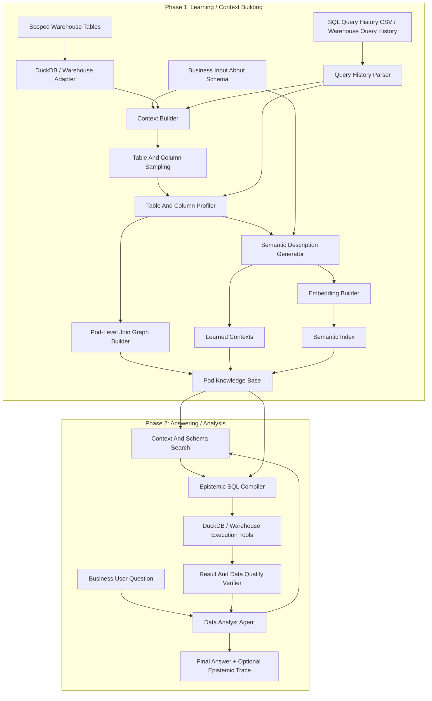

# Engineering Architecture

## Goal

Build a standalone `diracdata` package that provides trustworthy data agents for business users who ask questions over a scoped data pod.

The architecture has two explicit phases:

1. Learning: convert scoped warehouse tables into durable business context.
2. Answering: answer user questions by searching and using that learned context.

This separation is a core product decision. The agent should not rediscover the warehouse from scratch for every question.

## Architecture Overview



## Phase 1: Learning / Context Building

The learning phase turns a scoped warehouse pod into a living business document and machine-searchable semantic context.

It runs before answering and can be rerun when tables, business definitions, query history, or data quality expectations change.

### Inputs

- Scoped pod tables from the warehouse
- SQL dialect
- Business input about the schema
- Business glossary and metric definitions when available
- Query history provided as CSV or through a warehouse connection
- For MVP, DuckDB-compatible SQL query history

### Sampling Requirements

For every scoped table, the learning phase should collect:

- `select * limit 1000` style sample rows
- Column names and types
- Row counts where feasible
- Null rates
- Date ranges
- Numeric ranges
- Frequent values
- Distinct value samples

For column values, the target is at least 1000 distinct observed values per column where available and practical. The exact implementation must remain bounded by table size, cost policy, privacy policy, and column cardinality.

### Business Context Capture

The system should ask for or ingest human business input about:

- What the pod represents
- Which tables are trusted
- Which tables are deprecated or risky
- What each table roughly means
- Important metrics
- Important dimensions
- Business synonyms
- Known data quality caveats
- Known grain definitions

This is not optional flavor text. It is part of the learned context and should affect retrieval, join selection, and confidence.

### Learned Contexts

One pod can have multiple learned contexts.

The exact boundary of a context is still open, but the architecture should support multiple context artifacts per pod. Examples may include domain-specific contexts, metric-specific contexts, or audience-specific contexts.

Contexts should be short, simple, and semantically dense. They should optimize for business matching rather than verbose technical documentation.

### Living Enterprise Context

Learning should convert warehouse structure into a living document:

- Table descriptions
- Column descriptions
- Metric hints
- Dimension hints
- Grain hypotheses
- Common filters
- Common joins
- Data freshness expectations
- Data quality baselines
- Query history patterns

These descriptions should be usable by both humans and retrieval systems.

### Embeddings

Learned table, column, metric, and context descriptions should be convertible to embeddings.

BAAI/BGE is the leading proposed model family for local or open embedding support, but the exact model and runtime are not confirmed yet.

The design should allow:

- Lexical search without embeddings
- Local embedding models such as BAAI/BGE when configured
- Future hosted embedding providers if desired

### Query History

The learning phase should ingest SQL query history.

MVP query history sources:

- CSV file
- DuckDB table or view

Future query history sources:

- Databricks system query history
- Snowflake query history
- BigQuery jobs
- BI tool query exports

Query history is used to learn:

- Common table usage
- Common joins
- Common filters
- Metric definitions by repeated calculation
- Dashboard-like patterns
- Failed query patterns

### Pod-Level Join Graph

The join graph is learned across the pod, not inside only one context.

Join candidates should be discovered from:

- Column name similarity
- Data type compatibility
- Profile value overlap
- Cardinality and uniqueness
- Query history join predicates
- Business input
- Table role compatibility

The output should be a scored graph with evidence and risks for each edge.

## Phase 2: Answering / Analysis

The answering phase consumes learned context. It should not perform broad schema learning unless the context is missing, stale, or insufficient.

### Inputs

- Business user question
- Pod id
- Selected learned context or context search policy
- Pod knowledge base
- SQL dialect
- Execution policy
- Warehouse adapter

### Runtime Flow

1. Interpret the user question in business terms.
2. Search learned contexts, table descriptions, column descriptions, metrics, and dimensions.
3. Use the pod-level join graph to propose safe joins.
4. Build a staged query plan.
5. Execute intermediate SQL checks.
6. Verify joins, freshness, row counts, null rates, shape, and final result support.
7. Return a concise answer with optional epistemic trace.

### Data Analyst Agent

The answering agent is a LangGraph graph, not a single prompt chain.

Candidate graph nodes:

- Interpret business question
- Search learned context
- Select candidate tables, metrics, dimensions, and joins
- Propose query plan
- Compile staged SQL
- Execute intermediate checks
- Verify results
- Repair query plan when checks fail
- Produce final answer and trace

### Epistemic SQL Compiler

The compiler transforms a question plus learned context into a staged query plan.

It should avoid one-shot final SQL. It should generate small verifiable SQL fragments, run checks, and use verification results to revise or refuse the plan.

### Verification Layer

The verifier checks whether the result is plausible, not merely whether SQL executed.

Check categories:

- SQL syntax and dialect compatibility
- Table availability in the selected pod
- Context freshness
- Data freshness
- Date coverage
- Row counts
- Join expansion or loss
- Null rates
- Duplicate keys
- Grain consistency
- Distribution sanity
- Final answer support

## Core Storage Artifacts

### Pod Knowledge Base

The pod knowledge base stores learning outputs across the whole pod:

- Raw schema metadata
- Table profiles
- Column profiles
- Query history features
- Pod-level join graph
- Data quality baselines
- Learned contexts
- Search indexes

### Learned Context

A learned context is a semantic artifact inside a pod.

It should contain:

- Context id
- Pod id
- Business description
- Included tables
- Table descriptions
- Column descriptions
- Metric and dimension hints
- Relevant query history patterns
- Embedding records when configured

### Trace Store

The trace captures answering artifacts in a user-safe and audit-friendly form:

- Step name
- Tool call
- SQL fragment
- Result shape
- Verification checks
- Warnings
- Confidence
- Decision

## Warehouse Adapter

The execution abstraction supports both learning and answering.

MVP adapter:

- DuckDB over local parquet

Future adapters:

- Databricks SQL
- Snowflake
- BigQuery
- Postgres
- S3 or object-store backed tables

The adapter should expose structured methods:

- list schemas
- list tables
- describe table
- sample table
- profile column values
- execute SQL
- explain SQL when supported
- estimate cost when supported
- get freshness signal when supported

## Proposed Package Layout

```text
src/diracdata/
  agents/
    data_analyst.py
  core/
    catalog.py
    compiler.py
    context.py
    embeddings.py
    joins.py
    learning.py
    profiler.py
    query_history.py
    semantics.py
    verification.py
  tools/
    factory.py
    schema_tools.py
    profile_tools.py
    join_tools.py
    sql_tools.py
  evals/
    tpcds.py
    query_history.py
    questions.py
```

This layout is proposed for review and will be implemented after the docs settle.

## Design Constraints

- Learning and answering are separate phases.
- The answering agent consumes learned context.
- A pod can have multiple contexts.
- Join graph is built across the pod, not only inside individual contexts.
- The agent must expose final answer and optional epistemic trace.
- Intermediate execution must be available for verification.
- Large result handling must avoid dumping huge tables into model context.
- Schema and result data must be summarized structurally before being shown to the model.
- SQL dialect should be explicit, even when DuckDB is the only implemented engine.
- Query history should be represented with a warehouse-agnostic schema.

## Open Architecture Questions

- What exactly defines a context inside a pod: business domain, metric family, audience, task, or manually named slice?
- Should BAAI/BGE embeddings be mandatory for the MVP or optional behind a local embedding interface?
- Which BGE model and runtime should be the first target?
- Should learned context be persisted as JSON, DuckDB tables, SQLite, or a vector-store-backed catalog?
- How should the system detect that learned context is stale and needs relearning?
- What privacy policy should govern storing sample rows and distinct values?
- Which LangGraph persistence model should be used for traces and resumable analysis?
- What is the first Python sandbox boundary: subprocess, restricted runtime, or containerized execution?
