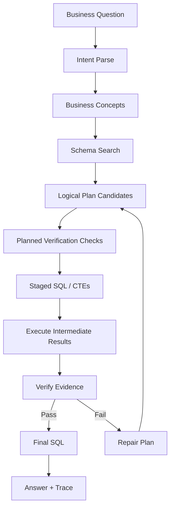

# Epistemic SQL Compiler

## Definition

The epistemic SQL compiler is the planning and verification system that turns a business question into SQL through small, tested, auditable steps.

It should treat SQL generation as a compiler problem with uncertainty:

- Parse user intent.
- Resolve business semantics to schema.
- Create candidate logical plans.
- Compile into staged SQL fragments.
- Execute verification checks.
- Repair plans when evidence contradicts assumptions.
- Produce a final answer only when the result is sufficiently supported.

## Why Compiler Instead Of One-Shot SQL

One-shot SQL often fails silently:

- Wrong table chosen
- Wrong grain
- Wrong date filter
- Bad join
- Missing filter
- Stale data
- Duplicate inflation
- Null-heavy metric
- Dialect mismatch
- Final answer not supported by result

The compiler approach makes these failures observable.

## Proposed Pipeline

## Plan Representation

A query plan should be structured before it becomes SQL.

Candidate fields:

- User question
- Business concepts
- Candidate metrics
- Candidate dimensions
- Candidate filters
- Candidate fact tables
- Candidate dimension tables
- Join graph
- Grain hypothesis
- Date range
- Verification checks
- SQL dialect

## Staged SQL Strategy

The compiler should prefer staged SQL:

1. Base table coverage check
2. Date coverage and freshness check
3. Fact table grain inspection
4. Dimension key uniqueness check
5. Join row-count check
6. Filter selectivity check
7. Metric calculation check
8. Final aggregation

## Verification Checks

### Before Final Query

- Are required tables present in the pod?
- Do selected tables contain the requested time period?
- Is the metric column non-null enough to be useful?
- Are join keys compatible by type and value?
- Are dimension keys unique at the expected grain?
- Does the join inflate or drop rows unexpectedly?

### After Final Query

- Does the result contain the expected shape?
- Are values within plausible ranges?
- Does the final answer match the result table?
- Are there data quality warnings that should be elevated?
- Should the answer be softened because evidence is partial?

## Epistemic Output Contract

Every answer should include, internally or visibly:

- `answer`: concise business answer
- `result_summary`: shape, key values, and notable distributions
- `sql`: final SQL
- `checks`: verification checks and outcomes
- `warnings`: data quality or ambiguity warnings
- `confidence`: calibrated qualitative confidence
- `trace`: optional detailed execution trace

## Confidence Language

The agent should avoid false precision.

Suggested confidence labels:

- High: schema mapping is strong, joins verified, data freshness acceptable, result shape plausible.
- Medium: answer likely, but one or more checks are incomplete or weak.
- Low: answer is directional only; schema, data quality, or join evidence is insufficient.
- Unable to answer: the data context does not support the question.

## Open Compiler Questions

- Should the compiler generate multiple candidate plans and rank them, or generate one plan then repair?
- Which checks should be mandatory before any final answer?
- How should the agent decide that a verification failure is repairable vs answer-blocking?
- How much of the trace should be exposed by default to non-technical users?

