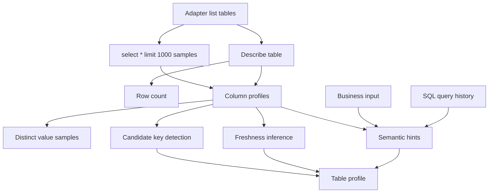

# Low Level Design

## Purpose

This document defines the first concrete interfaces for the core MVP modules:

- Pod context
- Learned contexts
- Warehouse adapter
- Schema profiling
- Semantic catalog
- Join discovery
- SQL execution tools
- Result summarization
- Verification checks
- Agent trace

The design is a first draft for review, not a frozen API.

## Core Data Models

### PodContext

Represents the scoped data pod for a business team.

```python
class PodContext(BaseModel):
    pod_id: str
    name: str
    description: str
    sql_dialect: str
    allowed_tables: list[str]
    glossary: dict[str, str] = {}
    metrics: dict[str, MetricDefinition] = {}
    dimensions: dict[str, DimensionDefinition] = {}
    quality_expectations: list[QualityExpectation] = []
    execution_policy: ExecutionPolicy
```

### LearnedContext

Represents a learned semantic artifact inside a pod. One pod can have multiple contexts.

```python
class LearnedContext(BaseModel):
    context_id: str
    pod_id: str
    name: str
    description: str
    included_tables: list[str]
    table_descriptions: dict[str, str]
    column_descriptions: dict[str, str]
    metric_hints: dict[str, str]
    dimension_hints: dict[str, str]
    query_history_patterns: list[str]
    embedding_record_ids: list[str]
```

### PodKnowledgeBase

Represents learned artifacts across the whole pod.

```python
class PodKnowledgeBase(BaseModel):
    pod_id: str
    table_profiles: dict[str, TableProfile]
    learned_contexts: dict[str, LearnedContext]
    join_graph: JoinGraph
    data_quality_baselines: list[QualityBaseline]
    search_records: list[SearchRecord]
    embedding_records: list[EmbeddingRecord]
```

### LearningConfig

Controls bounded warehouse learning.

```python
class LearningConfig(BaseModel):
    sample_rows_per_table: int = 1000
    distinct_values_per_column: int = 1000
    include_sample_values: bool = True
    embedding_provider: str | None = None
    query_history_source: QueryHistorySource | None = None
```

### TableProfile

```python
class TableProfile(BaseModel):
    table_name: str
    row_count: int | None
    column_count: int
    columns: list[ColumnProfile]
    candidate_keys: list[KeyCandidate]
    date_columns: list[str]
    metric_like_columns: list[str]
    dimension_like_columns: list[str]
    freshness: FreshnessSignal | None
```

### ColumnProfile

```python
class ColumnProfile(BaseModel):
    table_name: str
    column_name: str
    data_type: str
    null_count: int | None
    null_rate: float | None
    distinct_count: int | None
    min_value: str | int | float | None
    max_value: str | int | float | None
    top_values: list[ValueCount]
    sample_values: list[str]
    distinct_sample_values: list[str]
    semantic_hints: list[str]
    description: str | None
```

### SearchResult

```python
class SearchResult(BaseModel):
    entity_type: Literal["table", "column", "metric", "join"]
    entity_id: str
    score: float
    reason: str
    evidence: list[str]
```

### JoinCandidate

```python
class JoinCandidate(BaseModel):
    left_table: str
    left_column: str
    right_table: str
    right_column: str
    score: float
    confidence: Literal["low", "medium", "high"]
    evidence: list[str]
    risks: list[str]
```

### EmbeddingRecord

```python
class EmbeddingRecord(BaseModel):
    record_id: str
    entity_type: Literal["context", "table", "column", "metric", "dimension"]
    entity_id: str
    text: str
    model: str
    vector: list[float]
```

### QueryTrace

```python
class QueryTrace(BaseModel):
    trace_id: str
    question: str
    steps: list[TraceStep]
    final_sql: str | None
    warnings: list[str]
    confidence: Literal["low", "medium", "high", "unable_to_answer"]
```

## Warehouse Adapter Interface

```python
class WarehouseAdapter(Protocol):
    dialect: str

    def list_tables(self) -> list[str]: ...
    def describe_table(self, table_name: str) -> TableSchema: ...
    def sample_table(self, table_name: str, limit: int) -> ResultFrame: ...
    def execute_sql(self, sql: str, limits: QueryLimits) -> QueryResult: ...
    def explain_sql(self, sql: str) -> ExplainResult | None: ...
```

The MVP implementation is `DuckDBAdapter`.

Adapter rules:

- Read-only SQL only.
- Explicit row limits for result materialization.
- Structured result metadata for large outputs.
- Dialect field must be explicit.
- SQL execution errors must be returned as structured failures, not only strings.

## Profiling Flow



Profiling must be bounded.

Controls:

- Max rows sampled
- Max distinct values sampled per column
- Max top values per column
- Max columns profiled per table for smoke tests
- Approximate counts when exact counts are expensive

## Learning Interface

```python
class ContextBuilder(Protocol):
    def learn_pod(
        self,
        pod_context: PodContext,
        adapter: WarehouseAdapter,
        business_input: BusinessInput,
        config: LearningConfig,
    ) -> PodKnowledgeBase: ...
```

## Semantic Catalog Interface

```python
class SemanticCatalog(Protocol):
    def build(self, knowledge_base: PodKnowledgeBase) -> None: ...
    def search(self, query: str, top_k: int) -> list[SearchResult]: ...
    def find_joins(self, tables: list[str], top_k: int) -> list[JoinCandidate]: ...
    def get_table_profile(self, table_name: str) -> TableProfile: ...
```

MVP catalog can be in-memory plus persisted JSON or DuckDB tables. The persistence choice is still open.

## Join Discovery Scoring

Each candidate join receives component scores:

- Name similarity
- Data type compatibility
- Value overlap
- Key uniqueness
- Cardinality compatibility
- Query history frequency
- Table role compatibility

Example scoring shape:

```python
score = (
    0.20 * name_similarity
    + 0.15 * type_compatibility
    + 0.25 * value_overlap
    + 0.15 * key_uniqueness
    + 0.10 * cardinality_compatibility
    + 0.15 * query_history_signal
)
```

Weights are proposed and should be tuned by evals.

## SQL Tool Contract

The agent should call tools that return compact structured output.

```python
class QueryResult(BaseModel):
    sql: str
    status: Literal["success", "error"]
    row_count: int | None
    column_names: list[str]
    column_types: list[str]
    preview_rows: list[dict[str, Any]]
    summary: ResultSummary
    error: QueryError | None
```

Large results should never be returned directly to the model.

## Result Summary

```python
class ResultSummary(BaseModel):
    shape: tuple[int | None, int]
    numeric_summaries: dict[str, NumericSummary]
    categorical_summaries: dict[str, CategoricalSummary]
    date_summaries: dict[str, DateSummary]
    null_rates: dict[str, float]
    warnings: list[str]
```

## Verification Check Interface

```python
class VerificationCheck(BaseModel):
    name: str
    description: str
    status: Literal["pass", "fail", "warning", "skipped"]
    evidence: list[str]
    severity: Literal["info", "warning", "critical"]
```

Mandatory MVP checks:

- Table availability
- Date coverage
- Data freshness
- Join row-count change
- Dimension key uniqueness
- Null rate on metric columns
- Final result shape
- Final answer support

## Agent State

```python
class DataAnalystState(TypedDict):
    question: str
    pod_context: PodContext
    schema_results: list[SearchResult]
    candidate_joins: list[JoinCandidate]
    plan: QueryPlan | None
    intermediate_results: list[QueryResult]
    verification_checks: list[VerificationCheck]
    final_sql: str | None
    final_answer: str | None
    warnings: list[str]
    trace: QueryTrace
```

## Initial Module Responsibilities

### `core/context.py`

Pod context, learned contexts, metric definitions, execution policy, and quality expectations.

### `tools/duckdb_adapter.py`

DuckDB connection, local parquet registration, schema introspection, read-only execution, and result summaries.

### `core/learning.py`

Context building orchestration across scoped tables, business input, profiling, embeddings, and join graph creation.

### `core/profiler.py`

Table and column profile generation from adapter outputs.

### `core/query_history.py`

CSV and DuckDB query history ingestion, SQL parsing, and usage feature extraction.

### `core/embeddings.py`

Embedding provider interface. BAAI/BGE is the leading proposed local model family, but the exact implementation is open.

### `core/semantics.py`

Search records, lexical scoring, glossary matching, and optional embedding interface.

### `core/joins.py`

Join candidate generation and scoring.

### `core/verification.py`

Structured verification checks over intermediate and final query results.

### `core/compiler.py`

Query plan representation, staged SQL generation, and repair loop.

### `agents/data_analyst.py`

LangGraph graph construction and public `data_analyst_agent` entrypoint.

## Open Low-Level Questions

- Should `QueryResult` preview rows use pandas, Arrow, or plain Python dictionaries at the public boundary?
- Should profiles store sample values by default, or require an explicit opt-in?
- Should DuckDB views be created for each parquet file, or should SQL reference parquet paths directly?
- Should read-only SQL validation use `sqlglot`, DuckDB parser inspection, or both?
- Should the first trace format be JSONL for easy inspection?
- What exactly defines a learned context inside a pod?
- Should BAAI/BGE embeddings be required for MVP or optional?
- Should query history CSV use Databricks-like fields or a smaller warehouse-agnostic schema?
